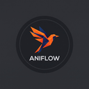

<p align="center">
  
</p>

<h1 align="center">AniFlow</h1>
<p align="center">
  <strong>Turn manhwa &amp; webtoon chapters into narrated recap videos — fully automated.</strong>
</p>

<p align="center">
  <a href="#-quick-start"></a>
  
  
  
</p>

---

AniFlow downloads manhwa/webtoon chapters, detects and crops panels using YOLO, extracts speech-bubble text, generates AI narration, converts it to speech, and renders video clips — all through a browser-based UI.

## ✨ Features

- 🌐 **Web Scraper** — download chapters from manhuaus, manhwatop, MangaDex, and more
- 🔍 **YOLO Panel Detection** — custom-trained models detect panels and speech bubbles
- 🧹 **Text Removal** — automatically clean speech bubbles from art panels
- 🤖 **AI Narration** — local (Ollama) or cloud (Gemini / Claude) narration
- 🎙️ **Multi-TTS** — Edge TTS (free), Kokoro (local), or ElevenLabs (cloud)
- 🎬 **Video Rendering** — Ken Burns animation, blur backgrounds, BGM, watermarks
- 👥 **Character Casting** — import from MyAnimeList or scan faces from chapters
- 📦 **Batch Mode** — process dozens of chapters unattended

### Two Pipelines

| | **Dialogue Recap** | **Narrated Recap** |
|---|---|---|
| Panels | Original panels with speech bubbles | Clean art panels (bubbles removed) |
| Audio | Extracted dialogue read aloud | AI-written YouTube-style recap narration |
| Best for | Letting the original dialogue shine | YouTube story recaps |

> 📂 **See it in action!** Check the [`example_output/`](example_output/) folder for sample clips from both modes.

### 🎥 Video Tutorials

| Tutorial | Link |
|---|---|
| 💬 Dialogue Recap — Single Chapter | [Watch on YouTube](https://www.youtube.com/watch?v=8sgy2MkgFTo) |
| 💬 Dialogue Recap — Batch Mode (50+ Chapters) | [Watch on YouTube](https://www.youtube.com/watch?v=ByvZbpOEd5Q) |
| 🎙️ Narrated Recap — Automatic Pipeline | [Watch on YouTube](https://www.youtube.com/watch?v=5z_xYdvDj1E) |
| 🎙️ Narrated Recap — Batch Mode (Full Series) | [Watch on YouTube](https://www.youtube.com/watch?v=uqoGjsFDk2k) |

---

## 📋 Requirements

| Dependency | Purpose | Install |
|---|---|---|
| **Python 3.10 – 3.12** | Runtime | [python.org](https://www.python.org/downloads/) |
| **FFmpeg** | Video/audio processing | `brew install ffmpeg` (macOS) · `sudo apt install ffmpeg` (Linux) · [ffmpeg.org](https://ffmpeg.org/download.html) (Windows) |
| **Ollama** | Local AI narration & text extraction | [ollama.com](https://ollama.com) |
| **~10 GB disk** | Python env + model weights | — |

> **GPU recommended** but not required. Apple Silicon Macs and NVIDIA GPUs will significantly speed up panel detection and Kokoro TTS.

---

## 🚀 Quick Start

### Option A: One-Command Setup (Recommended)

```bash
git clone https://github.com/aashish254/Aniflow.git
cd AniFlow
chmod +x setup.sh
./setup.sh
```

The setup script will check dependencies, create a virtual environment, install packages, pull Ollama models, and start the app.

### Option B: Manual Setup

```bash
# 1. Clone the repository
git clone https://github.com/aashish254/Aniflow.git
cd AniFlow

# 2. Create a virtual environment
python3 -m venv venv
source venv/bin/activate          # macOS / Linux
# venv\Scripts\activate           # Windows (Command Prompt)
# venv\Scripts\Activate.ps1       # Windows (PowerShell)

# 3. Install Python dependencies (~10-20 min, torch is large)
pip install --upgrade pip
pip install -r requirements.txt

# 4. Pull the Ollama models (requires Ollama running)
ollama pull qwen2.5vl:3b          # Vision parser (required)
ollama pull qwen2.5:14b           # Text-only narrator (recommended)
# ollama pull qwen2.5vl:7b        # Vision narrator (optional, larger)

# 5. (Optional) Copy and fill in API keys
cp .env.example .env

# 6. Start the app
python app.py
# → Open http://localhost:8080
```

### Windows Setup

```powershell
# 1. Clone and enter the project
git clone https://github.com/aashish254/Aniflow.git
cd AniFlow

# 2. Run the setup script
setup.bat
```

Or follow the manual steps above using `venv\Scripts\activate` instead.

---

## 🎬 How to Use

### Narrated Recap (Recommended)

1. **Source** — Paste a manhwa URL → **Analyze** → pick chapters → **Download**
   (or point to a local folder of images)
2. **Cast** *(optional)* — Import characters from MyAnimeList, or scan chapter faces
   and assign names. The narrator uses real names ("Jin-Woo…") instead of "the dark-haired guy."
3. **Stitch** — Stitch → Detect (bubble panels) → Crop → Stitch → Detect (art panels) → Crop.
   Boxes are editable — drag, resize, or draw new ones.
4. **Review** — Check cropped panels; delete junk or re-crop.
5. **Extract** — AI reads speech-bubble text.
6. **Narrate** — Choose your AI backend:
   - 🦙 **Ollama (local)** — free & offline. `qwen2.5vl:7b` (vision) or `qwen2.5:14b` (text-only).
   - ✨ **Gemini API** — paste multiple API keys (auto-rotation on quota). Free keys at [aistudio.google.com](https://aistudio.google.com).
   - 🤖 **Claude API** — single key.
7. **Review Text** — Edit any narration line or re-narrate individual panels.
8. **Audio** — TTS with Edge (free), Kokoro (local), or ElevenLabs.
9. **Video** — Renders clips with Ken Burns animation, blur backgrounds, BGM.
10. **Review Clips / Sort Clips** — Preview, download, or batch-merge.

### Dialogue Recap

Same flow minus the cast/narrate steps — extracted dialogue becomes the audio,
panels keep their original speech bubbles.

### Batch Mode

Download chapters 1–68, enable **Batch Mode**, hit **Run Full Batch** — every step
runs across all chapters automatically. Progress is streamed live.

---

## 📁 Project Structure

```
AniFlow/
├── app.py                  # Flask web app + API routes
├── config.py               # All configuration & path settings
├── requirements.txt        # Python dependencies
├── setup.sh / setup.bat    # One-command setup scripts
├── start.sh                # Quick-start script (macOS/Linux)
│
├── pipeline/               # Core processing modules
│   ├── web_scraper.py      #   Chapter downloading (multi-site)
│   ├── stitcher.py         #   Image stitching
│   ├── panel_extractor_yolo.py  # YOLO panel detection
│   ├── cropper.py          #   Panel cropping
│   ├── text_extractor.py   #   OCR / text extraction
│   ├── text_remover.py     #   Speech bubble cleaning
│   ├── narrator.py         #   Local AI narration (Ollama)
│   ├── gemini_narrator.py  #   Cloud narration (Gemini API)
│   ├── scene_narrator.py   #   Scene-level narration
│   ├── tts_engine.py       #   Edge TTS engine
│   ├── kokoro_tts.py       #   Kokoro local TTS
│   ├── elevenlabs_tts.py   #   ElevenLabs cloud TTS
│   ├── compositor.py       #   Video rendering
│   ├── orchestrator.py     #   Pipeline orchestration
│   ├── cast_system.py      #   Character management
│   ├── character_builder.py #  Face detection & grouping
│   ├── mal_character_importer.py # MAL character import
│   ├── script_rewriter.py  #   Narration style rewriter
│   ├── capcut_director.py  #   CapCut export
│   └── panel_filter.py     #   Panel quality filtering
│
├── models/                 # YOLO model weights (committed)
│   ├── manhwa_panel_cropped.pt      # Art panel detector
│   └── panel_with_bubble_text.pt    # Bubble panel detector
│
├── templates/              # HTML templates
├── static/                 # CSS, JS, logos
├── assets/                 # BGM, watermarks, intros, outros
└── tests/                  # Test & diagnostic scripts
```

### Generated Folders (gitignored)

| Folder | Contents |
|---|---|
| `manhwa_download/` | Downloaded chapter images + per-chapter state |
| `manhwa_stitch/` | Stitched full-page strips |
| `manhwa_detect/` | Detection metadata (bounding boxes) |
| `manhwa_crop/` | Cropped individual panels |
| `manhwa_text/` | Extracted dialogue JSON |
| `manhwa_audio/` | Generated TTS audio files |
| `manhwa_clips/` | Final rendered video clips |
| `output/` | Legacy output directory |
| `~/RECAP/Cast Data/` | Your character casts (faces + profiles) |

All generated data is **regenerable** — delete any folder and re-run the pipeline.

---

## ⚙️ Configuration

### API Keys (Optional)

Copy `.env.example` to `.env` and fill in keys only for services you want to use:

```bash
cp .env.example .env
```

| Key | Service | Required? |
|---|---|---|
| `GEMINI_API_KEY` | Google Gemini narration | Only if using Gemini |
| `ANTHROPIC_API_KEY` | Claude narration | Only if using Claude |
| `ELEVENLABS_API_KEY` | ElevenLabs TTS | Only if using ElevenLabs |
| `MAL_CLIENT_ID` | MyAnimeList import | Only if importing characters from MAL |

> **Ollama + Edge TTS work completely offline** — no API keys needed for the core pipeline.

### Ollama Models

| Model | Role | Size | Required? |
|---|---|---|---|
| `qwen2.5vl:3b` | Vision parser (reads panels) | ~2 GB | ✅ Required |
| `qwen2.5:14b` | Text-only narrator | ~9 GB | 📌 Recommended |
| `qwen2.5vl:7b` | Vision narrator (sees panels + cast) | ~5 GB | Optional |

---

## 🔧 Troubleshooting

| Problem | Solution |
|---|---|
| **"Address already in use"** | Another instance is running: `lsof -ti :8080 \| xargs kill -9` |
| **Ollama dot is red** | Start Ollama and pull models: `ollama pull qwen2.5vl:3b` |
| **Downloads hang** | Protected site — the app auto-switches to headless browser (~40s). MangaDex URLs are most reliable. |
| **Bubbles not removed** | EasyOCR inpainter handles clear bubbles; complex ones can be fixed with the crop tool in Review. |
| **`ModuleNotFoundError`** | Make sure your venv is activated: `source venv/bin/activate` |
| **Torch install fails** | Try: `pip install torch torchvision --index-url https://download.pytorch.org/whl/cpu` |

---

## 🙏 Acknowledgments & Credits

AniFlow is built on the shoulders of many incredible open-source projects. Huge thanks to:

### AI & Machine Learning
- **[Ollama](https://ollama.com)** — Local LLM runtime for AI narration and text extraction
- **[Qwen 2.5 VL](https://github.com/QwenLM/Qwen2.5-VL)** by Alibaba Cloud — Vision-language model for panel understanding
- **[Ultralytics YOLOv8](https://github.com/ultralytics/ultralytics)** — Object detection framework for panel detection
- **[Magi v2](https://github.com/ragavsachdeva/magiv2)** by Ragav Sachdeva — Manga/comic page understanding and speaker-aware transcription
- **[EasyOCR](https://github.com/JaidedAI/EasyOCR)** by JaidedAI — Text detection for speech bubble cleaning
- **[Manga OCR](https://github.com/kha-white/manga-ocr)** by kha-white — OCR tuned for manga/manhwa text
- **[Google Gemini API](https://aistudio.google.com)** — Cloud AI narration alternative
- **[Anthropic Claude API](https://www.anthropic.com)** — Cloud AI narration alternative

### Text-to-Speech
- **[Edge TTS](https://github.com/rany2/edge-tts)** by rany2 — Free Microsoft Edge TTS (default engine)
- **[Kokoro TTS](https://github.com/hexgrad/kokoro)** by hexgrad — High-quality local text-to-speech
- **[ElevenLabs](https://elevenlabs.io)** — Premium cloud TTS

### Video & Image Processing
- **[MoviePy](https://github.com/Zulko/moviepy)** by Zulko — Python video editing
- **[FFmpeg](https://ffmpeg.org)** — The backbone of all media processing
- **[OpenCV](https://opencv.org)** — Computer vision operations
- **[Pillow](https://python-pillow.org)** — Image manipulation

### Web Scraping
- **[Beautiful Soup](https://www.crummy.com/software/BeautifulSoup/)** by Leonard Richardson — HTML parsing
- **[curl_cffi](https://github.com/lexiforest/curl_cffi)** — Cloudflare-friendly HTTP with TLS fingerprinting
- **[CloudScraper](https://github.com/VeNoMouS/cloudflare-scraper)** by VeNoMouS — Cloudflare challenge bypass
- **[DrissionPage](https://github.com/g1879/DrissionPage)** by g1879 — Headless browser fallback for protected sites

### Web Framework
- **[Flask](https://flask.palletsprojects.com)** — Python web framework
- **[Flask-SocketIO](https://flask-socketio.readthedocs.io)** — Real-time progress streaming

### Other
- **[lbpcascade_animeface](https://github.com/nagadomi/lbpcascade_animeface)** by nagadomi — Anime/manga face detection cascade
- **[PyTorch](https://pytorch.org)** — Deep learning framework
- **[Hugging Face Transformers](https://github.com/huggingface/transformers)** — Model loading for Magi v2
- **[MyAnimeList](https://myanimelist.net)** — Character data source for the cast system

---

## 📜 License

This project is licensed under the [MIT License](LICENSE).

---

## 🤝 Contributing

Contributions are welcome! See [CONTRIBUTING.md](CONTRIBUTING.md) for guidelines.

---

<p align="center">
  Made with ❤️ for the manhwa community
</p>
